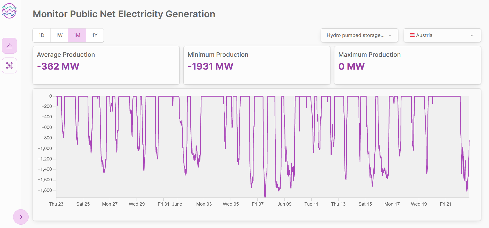

# Power Viewer

A small web application to view and analyze electricity data for various countries. The utilized data is fetched from the API provided by the [Fraunhofer Institute for Solar Energy Systems ISE](https://www.energy-charts.info/index.html?l=en&c=DE).

The application is built with [Next.js](https://nextjs.org/), [visx](https://airbnb.io/visx) for the visualizations and [radix-ui](https://www.radix-ui.com/) for accessible ui components and is deployed here:

https://power-viewer.vercel.app/monitoring

